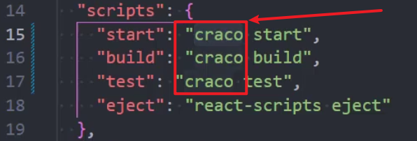

## news-system

### 1. JsonServer

1. get 查
2. post 增
3. put 修改（替换）
4. patch 修改（补丁式修改）
5. delete 删除
6. 联合查询 \_embed="字段名"

```
http://localhost:8080/rights?_embed=children
```

7. 联合查询 \_expand="字段名"

### 2. 项目初始化

#### 1. 使用 craco 修改 webpack 配置

```
// craco
npm i @craco/craco@alpha -D

// craco-less
npm i craco-less@2.1.0-alpha.0
```

> antd
>
> less
>
> 配置别名`@`
>
> `craco.config.js`文件

```js
const CracoLessPlugin = require("craco-less");
const path = require("path");

const resolve = (pathname) => path.resolve(__dirname, pathname);

module.exports = {
  // less
  plugins: [
    {
      plugin: CracoLessPlugin,
    },
  ],
  // webpack
  webpack: {
    alias: {
      "@": resolve("src"),
      components: resolve("src/components"),
      utils: resolve("src/utils"),
    },
  },
};
```

改为 craco 启动



#### 2. 配置 import 别名提示 及 其他 js 规范

```js
{
  "compilerOptions": {
    "target": "es5",
    "module": "esnext",
    "baseUrl": "./",
    "moduleResolution": "node",
    "paths": {
      "@/*":[
        "src/*"
      ]
    },
    "jsx": "preserve",
    "lib": [
      "esnext",
      "dom",
      "dom.iterable",
      "scripthost"
    ]
  }
}
```

#### 3. 引入 redux/toolkit

> RTK

```
npm install @reduxjs/toolkit react-redux
```

1. 创建 store——configureStore

```js
import { configureStore } from "@reduxjs/toolkit";
import menuListReducer from "./modules/menu-list";

export default configureStore({
  reducer: {
    menuList: menuListReducer,
  },
});
```

1. 创建 slice——createSlice

```js
import { getSideMenuByRoleId } from "@/services";
import { createAsyncThunk, createSlice } from "@reduxjs/toolkit";

export const fetchSideMenu = createAsyncThunk(
  "fetchSideMenu",
  (condition, { dispatch }) => {
    getSideMenuByRoleId().then((value) => {
      dispatch(changeSideMenu(value));
    });
  }
);

const sideMenuSlice = createSlice({
  name: "sideMenu",
  initialState: {
    menuList: [],
  },
  reducers: {
    changeSideMenu: (state, { payload }) => {
      state.menuList = payload;
    },
  },
});

export const { changeSideMenu } = sideMenuSlice.actions;

export default sideMenuSlice.reducer;
```

> 1. 这里默认暴露只有 `reducer`，slice 不用暴露
>
> 2. 分别暴露`actions`，是从对应的`slice`中暴露出来的

3. 全局提供 store

```jsx
import React from "react";
import ReactDOM from "react-dom/client";
import { HashRouter } from "react-router-dom";
import { Provider } from "react-redux";
import store from "./store";
import App from "./App";
import "@/assets/css/index.less";

const root = ReactDOM.createRoot(document.getElementById("root"));
root.render(
  <React.StrictMode>
    <HashRouter>
      <Provider store={store}>
        <App />
      </Provider>
    </HashRouter>
  </React.StrictMode>
);
```

> 1. `Provider` 是从 `react-redux` 中导入的

#### 4. 配置路由

1. 配置路由
2. 懒加载

```js
import { Suspense, lazy } from "react";

const page = lazy(() => import("@/views/page"));
```

> `lazy`函数传一个回调函数，回调函数指明懒加载组件的地址

3. 懒加载需要使用`Suspense`

> 1. 直接在 App 上面包裹`Suspense`(某个页面没出来，这个网页都显示`loading...`)
> 2. 将`Suspense`包裹在需要懒加载的页面
>    1. 为了避免重复给每一个包裹，我们抽取一个用于包裹的方法即可

```js
// 路由懒加载需要 <Suspense>
const pageLazyLoad = (Page) => {
  return (
    <Suspense fallback={<div>Loading</div>}>
      <Page />
    </Suspense>
  );
};
```

```js
import { Suspense, lazy } from "react";
import Login from "@/views/login";
import MyLayout from "@/components/layout";

// 首页
const Home = lazy(() => import("@/views/home"));
// 404
const ErrorPage = lazy(() => import("@/views/error"));

// 用户管理
const UserUpdate = lazy(() => import("@/views/user-manage/update"));
const UserAdd = lazy(() => import("@/views/user-manage/add"));
const UserDelete = lazy(() => import("@/views/user-manage/delete"));
const UserList = lazy(() => import("@/views/user-manage/list"));

// 权限管理
// 权限列表
const RightList = lazy(() => import("@/views/right-manage/right"));
// 角色列表
const RoleList = lazy(() => import("@/views/right-manage/role"));

// 新闻管理
const NewsAdd = lazy(() => import("@/views/news-manage/add"));
const NewsDraft = lazy(() => import("@/views/news-manage/draft"));
const NewsCategory = lazy(() => import("@/views/news-manage/category"));

//发布管理
const Sunset = lazy(() => import("@/views/publish-manage/sunset"));
const Published = lazy(() => import("@/views/publish-manage/published"));
const Unpublished = lazy(() => import("@/views/publish-manage/unpublished"));

// 路由懒加载需要 <Suspense>
const pageLazyLoad = (Page) => {
  return (
    <Suspense fallback={<div>Loading</div>}>
      <Page />
    </Suspense>
  );
};

const routes = [
  {
    path: "/",
    element: <MyLayout />,
    children: [
      {
        // 首页
        path: "home",
        element: pageLazyLoad(Home),
      },
      {
        // 用户管理
        path: "user-manage",
        children: [
          {
            path: "add",
            element: pageLazyLoad(UserAdd),
          },
          {
            path: "delete",
            element: pageLazyLoad(UserDelete),
          },
          {
            path: "update",
            element: pageLazyLoad(UserUpdate),
          },
          {
            path: "list",
            element: pageLazyLoad(UserList),
          },
        ],
      },
      {
        path: "right-manage",
        children: [
          {
            path: "role",
            children: [
              {
                path: "list",
                element: pageLazyLoad(RoleList),
              },
            ],
          },
          {
            path: "right",
            children: [
              {
                path: "list",
                element: pageLazyLoad(RightList),
              },
            ],
          },
        ],
      },
      {
        path: "news-manage",
        children: [
          {
            path: "add",
            element: pageLazyLoad(NewsAdd),
          },
          {
            path: "draft",
            element: pageLazyLoad(NewsDraft),
          },
          {
            path: "category",
            element: pageLazyLoad(NewsCategory),
          },
        ],
      },
      {
        path: "audit-manage",
        children: [
          {
            path: "audit",
          },
          {
            path: "list",
          },
        ],
      },
      {
        path: "publish-manage",
        children: [
          {
            path: "unpublished",
            element: pageLazyLoad(Unpublished),
          },
          {
            path: "published",
            element: pageLazyLoad(Published),
          },
          {
            path: "sunset",
            element: pageLazyLoad(Sunset),
          },
        ],
      },
    ],
  },
  {
    path: "/login",
    element: <Login />,
  },
  {
    path: "*",
    element: pageLazyLoad(ErrorPage),
  },
];

export default routes;
```

### 3. 侧边栏

#### 1. 菜单树需要递归清洗格式化为自己需要的数据

```js
/**
 * 递归格式化菜单树的数据
 * 1. 去除 rightId
 * 2. 去除 children = [] 的情况
 * 3. 去除 pagepermisson = 0 的情况
 * 4. 添加对应的 icon
 * @param {*} sideMune
 * @returns
 */

import {
  HomeOutlined,
  UserAddOutlined,
  AuditOutlined,
  ReadOutlined,
  VerifiedOutlined,
  SendOutlined,
} from "@ant-design/icons";

const iconList = {
  "/home": <HomeOutlined />,
  "/user-manage": <UserAddOutlined />,
  "/right-manage": <AuditOutlined />,
  "/news-manage": <ReadOutlined />,
  "/audit-manage": <VerifiedOutlined />,
  "/publish-manage": <SendOutlined />,
};

export function sideMenuFormat(menuList) {
  return menuList.map((item) => {
    let children = [];
    if (item.children) {
      children = sideMenuFormat(item.children);
    }
    const { id, title, label, key, grade, pagepermisson } = item;
    if (pagepermisson) {
      return children.length > 0
        ? { id, title, label, key, grade, children, icon: iconList[item.key] }
        : { id, title, label, key, grade, icon: iconList[item.key] };
    } else {
      return null;
    }
  });
}
```

> 1. 因为需要清洗的属性很多，所以我们使用`map()`
> 2. `map()`进行`children`的递归
> 3. 不返回时，返回`null`避免`map()`因为必须返回值导致的警告

> **[注意]**：`antd icon`组件放入`redux`中保存存在序列化**错误警告**

### 1. react router V6 实现前置路由首位

> 判断是否有权访问 page

#### 动态路由+路由权限设定思路

1. 成功登录以后，存储用户信息、权限到`redux`中
2. 因为页面刷新`redux`数据会丢失，为了实现刷新不丢失用户登录状态、路由权限，我们利用`cookie`来初始化`redux`中的状态、路由权限（这里使用`localStorage`模拟，实际上本地只存用户`token`，用户发起网站的会话时，使用`token`，获取路由权限，路由权限放在`cookie`中）
3. 我们在`App.jsx`中通过从`cookie`中获取用户路由权限
4. 因为页面刷新，由于加载顺序的原因，用户登录状态、路由权限还没有来得急初始化到`redux`中，会导致无法从`redux`中获取到路由权限，从而无权访问的情况，所以需要从`cookie`中获取，用户信息、路由权限
5. 其他页面涉及到路由权限判定时，就可以直接从`redux`中获取（比如`sideMenu`用户动态路由的侧边导航栏）

> **主要解决问题**
>
> 1. 实现用户登录状态的保持
> 2. 实现动态路由
> 3. 避免用户输入地址访问没有路由权限的`page`

#### routes 配置

`router/index.js`

```js
import { Suspense, lazy } from "react";
import Login from "@/views/login";
import MyLayout from "@/components/layout";

// 首页
const Home = lazy(() => import("@/views/home"));
// 404
const ErrorPage = lazy(() => import("@/views/error"));

// 用户管理
const UserUpdate = lazy(() => import("@/views/user-manage/update"));
const UserAdd = lazy(() => import("@/views/user-manage/add"));
const UserDelete = lazy(() => import("@/views/user-manage/delete"));
const UserList = lazy(() => import("@/views/user-manage/list"));

// 权限管理
// 权限列表
const RightList = lazy(() => import("@/views/right-manage/right"));
// 角色列表
const RoleList = lazy(() => import("@/views/right-manage/role"));

// 新闻管理
const NewsAdd = lazy(() => import("@/views/news-manage/add"));
const NewsDraft = lazy(() => import("@/views/news-manage/draft"));
const NewsCategory = lazy(() => import("@/views/news-manage/category"));

//发布管理
const Sunset = lazy(() => import("@/views/publish-manage/sunset"));
const Published = lazy(() => import("@/views/publish-manage/published"));
const Unpublished = lazy(() => import("@/views/publish-manage/unpublished"));

// 路由懒加载需要 <Suspense>
const pageLazyLoad = (Page) => {
  return (
    <Suspense fallback={<div>Loading</div>}>
      <Page />
    </Suspense>
  );
};

const routes = [
  {
    // FIXME 这里使用空，方便后边递归怕判断路由权限问题
    path: "",
    element: <MyLayout />,
    children: [
      {
        // 首页
        path: "home",
        element: pageLazyLoad(Home),
      },
      {
        // 用户管理
        path: "user-manage",
        children: [
          {
            path: "add",
            auth: true,
            element: pageLazyLoad(UserAdd),
          },
          {
            path: "delete",
            auth: true,
            element: pageLazyLoad(UserDelete),
          },
          {
            path: "update",
            auth: true,
            element: pageLazyLoad(UserUpdate),
          },
          {
            path: "list",
            auth: true,
            element: pageLazyLoad(UserList),
          },
        ],
      },
      {
        path: "right-manage",
        children: [
          {
            path: "role",
            children: [
              {
                path: "list",
                auth: true,
                element: pageLazyLoad(RoleList),
              },
            ],
          },
          {
            path: "right",
            children: [
              {
                path: "list",
                auth: true,
                element: pageLazyLoad(RightList),
              },
            ],
          },
        ],
      },
      {
        path: "news-manage",
        children: [
          {
            path: "add",
            auth: true,
            element: pageLazyLoad(NewsAdd),
          },
          {
            path: "draft",
            auth: true,
            element: pageLazyLoad(NewsDraft),
          },
          {
            path: "category",
            auth: true,
            element: pageLazyLoad(NewsCategory),
          },
        ],
      },
      {
        path: "audit-manage",
        children: [
          {
            path: "audit",
          },
          {
            path: "list",
          },
        ],
      },
      {
        path: "publish-manage",
        children: [
          {
            path: "unpublished",
            auth: true,
            element: pageLazyLoad(Unpublished),
          },
          {
            path: "published",
            auth: true,
            element: pageLazyLoad(Published),
          },
          {
            path: "sunset",
            auth: true,
            element: pageLazyLoad(Sunset),
          },
        ],
      },
    ],
  },
  {
    path: "/login",
    element: <Login />,
  },
  {
    path: "/error",
    element: pageLazyLoad(ErrorPage),
  },
  {
    path: "*",
    element: pageLazyLoad(ErrorPage),
  },
];

// 递归判断是否纯在该路由
const checkRoute = (routes, pathname, fatherPath = "") => {
  for (const route of routes) {
    const currentPath = fatherPath + route.path;
    if (currentPath === pathname) {
      return route;
    }
    if (route.children) {
      const res = checkRoute(route.children, pathname, currentPath + "/");
      if (res) {
        return res;
      }
    }
  }
  return null;
};

export function checkRouteAuth(pathname) {
  let auth = null;
  auth = checkRoute(routes, pathname);
  return auth;
}

export default routes;
```

> 1. 懒加载 需要使用 `<Suspense>`
> 2. 写一个懒加载函数 用于疯转需要懒加载的 page 组件
>    1. 不会整个页面处于`loading...`
>    2. 简化重复书写
> 3. 递归遍历路由时否存在，并返回路由信息，为了后续进行路由权限判断
>    1. 递归的时候需要注意子路由路径问题

#### 权限鉴定

使用`App`组件监视当前了路由地址

```jsx
import React, { Fragment, memo, useEffect } from "react";
import { useLocation, useNavigate, useRoutes } from "react-router-dom";
import { message } from "antd";
import routes, { checkRouteAuth } from "./router";
import { checkLoginStatus } from "./utils/check-login";

const App = memo(() => {
  const outlet = useRoutes(routes);

  const navigate = useNavigate();
  const { pathname } = useLocation();

  useEffect(() => {
    // 判断路由
    const route = checkRouteAuth(pathname);
    // 地址是否存在
    if (!route) {
      // 这里要使用 replace， 不然点击回退，会一直走这个逻辑
      navigate("/error", { replace: true });
    } else {
      // 判断权限
      if (route.auth) {
        // 判断用户是否登录
        const token = checkLoginStatus();
        if (token) {
          // 实际开发中，这里是从cookie中获取路由权限列表
          const rightList = JSON.parse(localStorage.getItem("right")).rightList;
          if (!rightList.includes(pathname)) {
            message.error("账号权限不足 ！");
            navigate("/error", { replace: true });
          }
        } else {
          message.error("请先登录 ！");
          navigate("/login");
        }
      }
    }
  }, [pathname, navigate]);

  return <Fragment>{outlet}</Fragment>;
});

export default App;
```

#### 登陆返回

`login.jsx`

```jsx
import React, { memo } from "react";
import { useNavigate } from "react-router-dom";
import { Button, Form, Input, message } from "antd";
import style from "./index.module.less";
import { userLogin } from "@/services";
const Login = memo(() => {
  const navigate = useNavigate();

  // 登录请求
  const onFinish = async (userInfo) => {
    const res = await userLogin(userInfo);
    if (res.data.length) {
      // 登陆成功
      message.success("登陆成功");
      navigate("/home");
      // 记录用户信息
      const adminInfo = res.data[0];
      const token = JSON.stringify(adminInfo);
      // 放入localStorage中
      localStorage.setItem("token", token);
    } else {
      message.warning("账号或密码错误...");
    }
  };

  const onFinishFailed = () => {
    console.log("表单验证失败");
  };

  return (
    <div className={style["login-page"]}>
      <div className={style["form-box"]}>
        <Form
          name="basic"
          labelCol={{ span: 8 }}
          wrapperCol={{ span: 16 }}
          initialValues={{ remember: true }}
          onFinish={onFinish}
          onFinishFailed={onFinishFailed}
          autoComplete="off"
        >
          <Form.Item
            label="Username"
            name="username"
            rules={[{ required: true, message: "Please input your username!" }]}
          >
            <Input />
          </Form.Item>

          <Form.Item
            label="Password"
            name="password"
            rules={[{ required: true, message: "Please input your password!" }]}
          >
            <Input.Password />
          </Form.Item>

          <Form.Item wrapperCol={{ offset: 8, span: 16 }}>
            <Button type="primary" htmlType="submit">
              Submit
            </Button>
          </Form.Item>
        </Form>
      </div>
    </div>
  );
});

export default Login;
```

> `react-router`中需要自己传递参数，表示`from`页面
